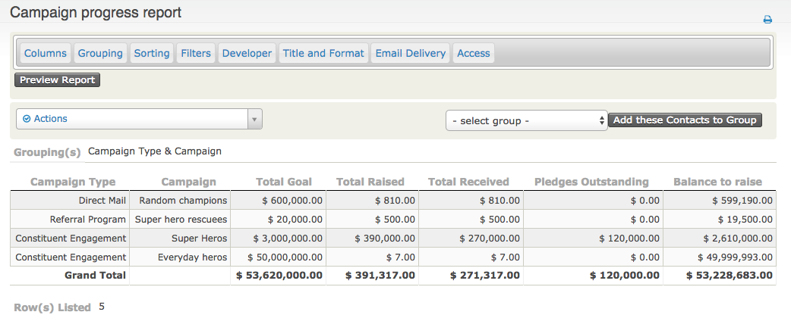

The Extended reports extension provides reports for tracking pledges in a variety of ways

## Campaign Progress Report

The campaign progress shows progress towards achieving pledge goals. Notably it includes pledges and contributions, showing both the received amount and the committed amount.

## Future Income Report

This report was designed to show projections of when money from pledges will be received - ie. to answer the question "how much money will be in by this date". Note that when grouping is used it shows a list of contact name for people who will pay in that period.

The report can also be used to see (and record) individual upcoming pledge payments if no grouping is applied.

